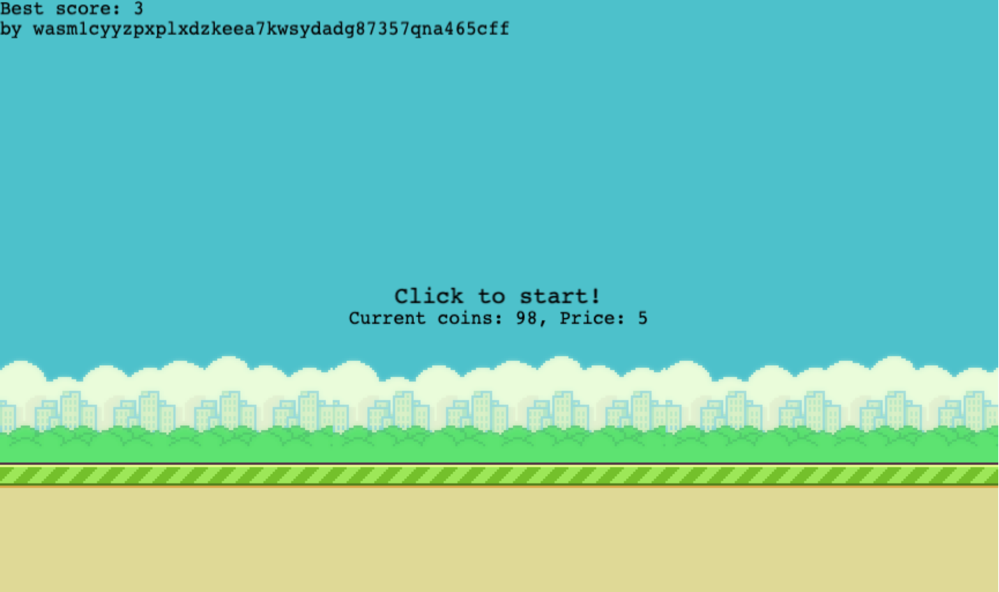

# Flappy CosmWasm with vulnerabilities

## Introduction

Here is a little demo game to show how to use CosmWasm to create a game with vulnerabilities. It uses a web client to play the game, a server to store the high scores and activate the smart contract, and a smart contract to mint and burn tokens.

## Development environment

* Keplr wallet
* stable-aarch64-apple-darwin (default)
* rustc 1.66.0 (69f9c33d7 2022-12-12)
* node v19.4.0
* go version go1.19 darwin/arm64
* wasmd v0.30.0

## Setup

- Download [wasmd v0.30.0](https://github.com/CosmWasm/wasmd/tree/v0.30.0) and make install
  - Make sure to checkout the v0.30.0 tag
  - Make sure wasmd is in your PATH
- Recover the Keplr wallet with the mnemonic in `mnemonic.txt`
- Compile the contracts `./scripts/optimize.sh` (or `./scripts/optimize-arm.sh` if you are on an ARM machine)
- Start the local chain `cd wasmd-chain && ./run_localnet.sh`
- Start the server `cd server && npm install && node server.js`
  - Use `node server.js --arm` to use the ARM artifacts
  - Listen on port 3001
  - Contracts are deployed automatically
- Start the client
  - Listen on port 3000
- Open your browser at http://localhost:3000
  - Keplr will ask to connect to the local chain

To summarize, you need three terminals open:

- `cd wasmd-chain && ./run_localnet.sh`
- `cd server && npm install && node server.js`
- `cd client && npm install && npm run build && node server.js`

## How to play

- Go to http://localhost:3000
- Connect to the local chain with Keplr
  - Recover the wallet with the mnemonic in `mnemonic.txt`
- The account is prefunded with 100 tokens
- Click to start and pay 5 tokens
- Click to jump, the goal is to avoid the pipes and earn 1 token per pipe
  - If you beat the high score, you will be rewarded with a 1.5 multiplier
- Repeat

## Vulnerabilities

If you crash the server, run it again with `node server.js --skipUploadInit` to skip the contract upload and save you some time. You also might want to delete the database file `server/data/highscores.db` to start fresh.

- Client side can be hacked
  - Possible to bypass payment
  - Possible to avoid collisions
  - Possible to disable gravity and control the bird
- Server can be crashed
  - Sending a non bech32 address
  - Sending a negative score
  - Sending a non-number score
  - And more...
- SQL injection
- potential server stored XSS in best player
  - NOT Reflected in best player since Phaser is just drawing a string
- Controller contract takeover
  - Update the admin address
  - Update the cw20 address
  - Mint tokens to any address
  - Burn tokens from any address
  - Set the best player
- Mint tokens without playing
  - Send a POST /scores directly to the server
- Change the best player
  - Send a POST /scores directly to the server
  - If you send a wrong address standard, the server will crash and there won't be any best player after restart (you can fix by deleting the database file)

## Troubleshooting

You can get an error of account sequence mismatch. In that case, reset the chain with `cd wasmd-chain && ./reset_localnet.sh` and restart the server (without skipping uploads) and client.

If you are on MacOS M1, build the contracts with `./scripts/optimize-arm.sh` instead of `./scripts/optimize.sh`, and run the server with `node server.js --arm` to use the ARM artifacts.